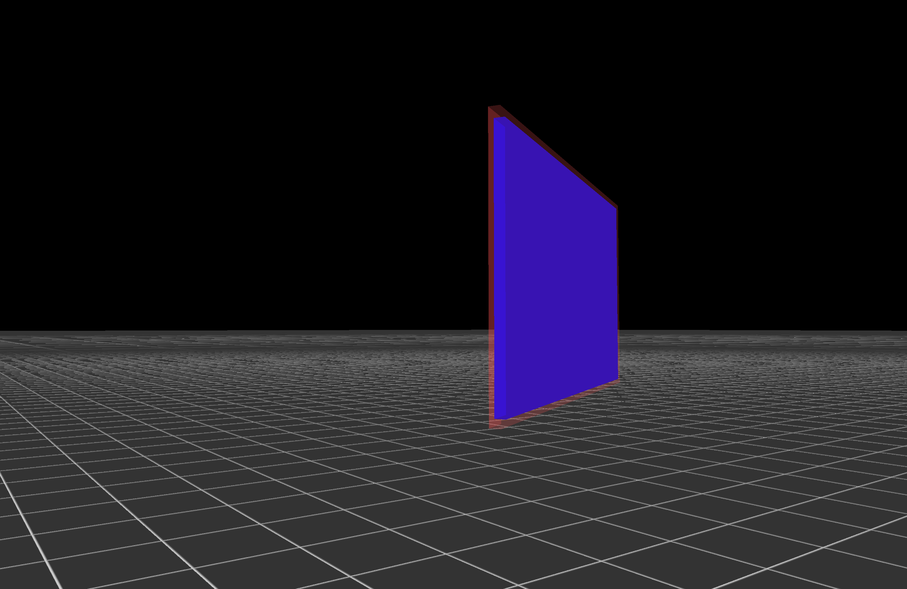

This a codebase I use to test various things with 3d rendering in OpenGL, from scratch in C. 

Currently, this takes the form of a very simple 3D engine that can render geometric primitives with textures.

Things implemented:
- 3d first person camera
- object management and support
- keybindings
- using the mouse to manipulate objects in the world
- a 3D grid showing world units



TODO: 
- implement NVIDIA PhysX (have code for a C/C++ ABI) lying around for gravity/movement/collision
- add 3d models and animations
- more as I think of things

# Instructions
requirements:

1. [GLFW3+](https://github.com/glfw/glfw)
2. [cglm](https://github.com/recp/cglm)

building and running:
```bash
cd src/
make
./editor
```

# Controls
1. WASD to move the camera
2. hold space while moving the mouse to pan
3. Left click on objects to select them for editing
4. move mouse to move objects, hold R and drag the mouse left-right to rotate along y-axis, bottom-up to rotate along x-axis

